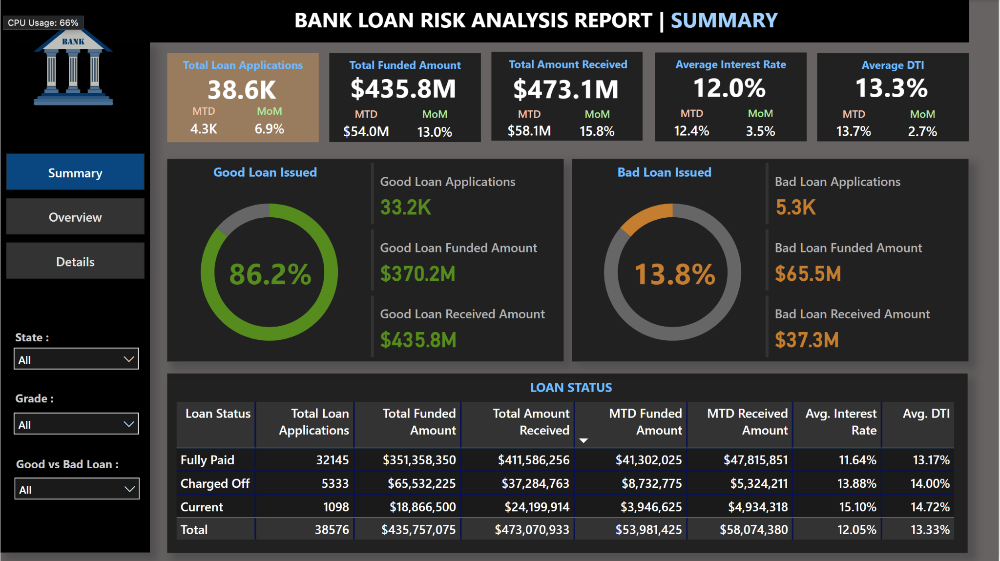
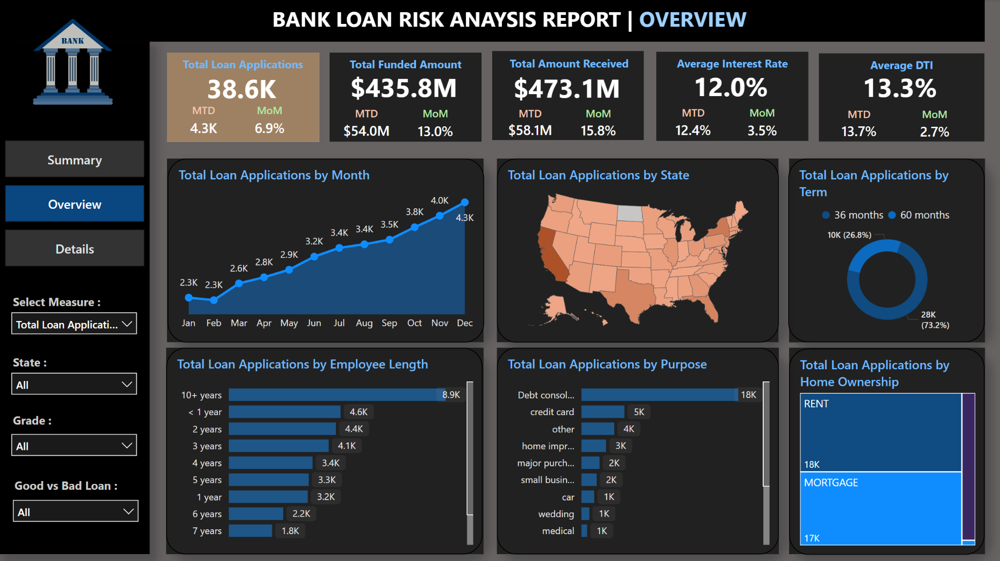
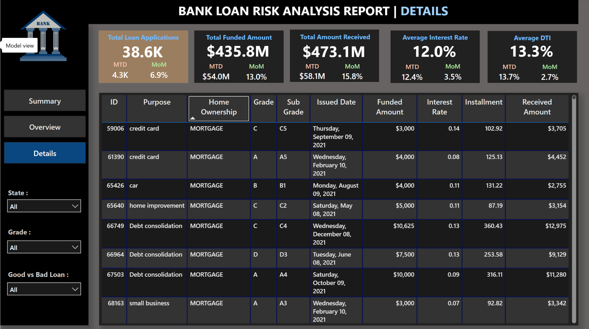

# Bank Loan Risk Analysis 📊

_SQL | Power BI_


---

## 📌 Project Overview

This project analyzes a bank loan dataset to evaluate loan risk, identify patterns in good vs bad loans, and provide actionable insights for decision-making.  
It combines **SQL-based data extraction & validation** with **Power BI dashboards** to deliver meaningful business intelligence.

---

## 📂 Dataset

- **Source**: Publicly available bank loan dataset from **Kaggle**.
- **Records**: 38,576 rows and 24 fields.
- **Fields include**: Loan status, loan amount, interest rate, DTI (Debt-to-Income ratio), customer demographics, and payment history.
- Data was provided as a `.csv` file.

---

## 🛠 Tools & Technologies

- **SQL** – For KPI extraction, aggregation queries, and Power BI validation
- **Power BI** – For dashboard design, visualization, and interactive analysis

---

## 📊 Dashboards & Features

1. **Summary Dashboard**
   - Shows high-level KPIs: Total loans, funded amount, collected amount, interest rate, DTI
   - Good vs Bad loan distribution
2. **Overview Dashboard**
   - Loan applications by month, state, term, purpose, and demographics
3. **Details Dashboard**
   - Filterable, drill-down view for granular loan analysis

---

## 🖼 Dashboards Preview

### 1. Summary Dashboard



### 2. Overview Dashboard



### 3. Details Dashboard



---

## 💡 How I Built the Visuals

- I first ran **SQL queries** on the dataset to compute key KPIs such as:
  - Total applications
  - Funded amount
  - Amount collected
  - Good loan percentage
  - Bad loan percentage
- These SQL outputs were compared against **Power BI dashboard measures** to validate accuracy.
- The **visuals were created directly in Power BI**:
  - Used clustered bar charts, pie/donut charts, maps, and cards
  - Applied slicers & filters for interactivity
  - Linked visuals for cross-filtering
- The **three dashboards** were built entirely inside Power BI based on the cleaned dataset and validated SQL results.

---

## 📈 Key Insights

- **83%** of loans are classified as _Good Loans_ (Fully Paid or Current)
- Majority of loans have **36-month terms**
- **California, Texas, and New York** lead in loan applications
- Most common purposes: _Debt consolidation_ and _Credit card refinancing_

---

## 📁 Project Structure

```
├── data/                           # Dataset (.csv)
├── sql/                            # SQL queries for KPIs and validation
├── reports/                        # Full report PDF
│   └── Bank_Loan_Analysis_Report_Full_with_SQL.pdf
├── images/                         # Dashboard screenshots
│   ├── summary_dashboard.png
│   ├── overview_dashboard.png
│   └── details_dashboard.png
├── dashboards/                     # Power BI files
│   └── Bank_Loan_Risk_Analysis.pbix
└── README.md                       # Project overview
```

---

## 📄 Reports

- [**Full Report with SQL Validation**](reports/Bank_Loan_Analysis_Report_Full_with_SQL.pdf) – Detailed analysis with KPIs, visuals, and SQL validation

---

## 📂 Power BI File

You can download and explore the interactive Power BI dashboard here:  
[Bank_Loan_Risk_Analysis.pbix](dashboards/Bank_Loan_Risk_Analysis.pbix)

---

## 🚀 How to View the Dashboards

1. Download the `.pbix` Power BI file from the `dashboards/` folder.
2. Open in Power BI Desktop.
3. Interact with filters and visuals.

---
